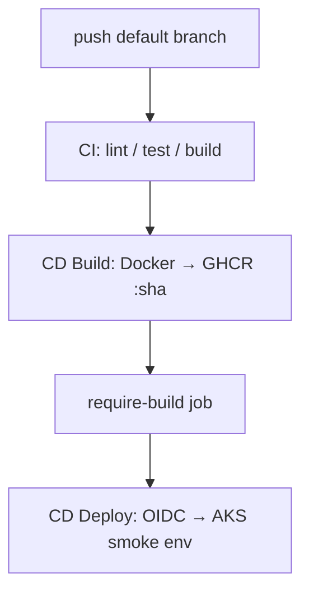

# SkullRender CI/CD standard

**Version:** 1.0  
**Status:** ✓ Current (see `docs/00-version-index.md`)  
**Scope:** All SkullRender repos with Docker + GHCR + optional AKS deploy  
**Reference implementation:** `DnDApp/` (first green pipeline, Phase 4 complete)

**Purpose:** Reusable pipeline — CI → CD Build (GHCR) → CD Deploy (AKS via OIDC).  
**No operational fingerprints in git:** project values live in GitHub Actions **variables**, **secrets**, and per-repo `deploy/local.env.ps1` (gitignored).

---

## Architecture

| Workflow | Trigger | Secrets | Variables |
|----------|---------|---------|-----------|
| `*-ci.yml` | PR + push | none | optional `CD_DEFAULT_BRANCH` |
| `*-cd-build.yml` | after green CI | `GITHUB_TOKEN` | `GHCR_*_PACKAGE` |
| `*-cd-deploy.yml` | after green CD Build | `AZURE_CLIENT_ID`, `AZURE_TENANT_ID`, `AZURE_SUBSCRIPTION_ID` | Azure RG/cluster, deploy env, ingress host |

---

## Three-layer configuration

| Layer | Where | Committed? | Examples |
|-------|--------|------------|----------|
| **Workflow logic** | `.github/workflows/*.yml` | Yes | SHA pins, gates — `${{ vars.* }}`, `${{ github.repository }}` |
| **Project values (cloud)** | GitHub → Actions → **Variables** | No | `AZURE_RESOURCE_GROUP`, `GHCR_API_PACKAGE` |
| **Project values (local)** | `deploy/local.env.ps1` | **No** (gitignored) | same names for `az` / `kubectl` / bootstrap |
| **Credentials** | GitHub **Secrets** + `gh auth` | Never in git | `AZURE_*`, `$(gh auth token)` at runtime |

**Per-repo files (copy from reference implementation):**

- `deploy/local.env.ps1.example` — template
- `deploy/scripts/set-github-cicd-vars.ps1` — sync local → GitHub vars
- `deploy/scripts/bootstrap-github-oidc.ps1` — one-time OIDC bootstrap

---

## Bootstrap a new repo (checklist)

1. Copy workflow trio from DnDApp — rename per project (`<app>-ci.yml`, etc.).
2. Copy `deploy/local.env.ps1.example` → `deploy/local.env.ps1` — fill Azure, GHCR names, namespace prefix, ingress host.
3. Run `.\deploy\scripts\set-github-cicd-vars.ps1`.
4. Create GHCR packages; **Manage Actions access → Write** on each package.
5. Run `.\deploy\scripts\bootstrap-github-oidc.ps1 -SetGitHubSecrets [-ApplyK8sRbac]` once.
6. Add K8s overlays + deploy scripts matching namespace prefix and environments.
7. Add **project runbook** `docs/deployment/COMMAND-REFERENCE.md` (operational commands — stays in the repo, not in this canon file).

---

## Conventions (all SkullRender deploy repos)

| Topic | Rule |
|-------|------|
| Image tags | `<git-short-sha>` only in CI — no `:latest` |
| GHCR path | `ghcr.io/${{ github.repository_owner }}/${{ vars.GHCR_API_PACKAGE }}:sha` |
| OCI source label | `${{ github.server_url }}/${{ github.repository }}` at build time |
| Auto deploy | One non-prod namespace only (e.g. `*-test`); prod manual promote |
| Docs in git | Placeholders + `local.env.ps1.example` — never user paths or live RG names |
| Doc-only commits | `[skip ci]` in commit message skips the chain (saves AKS cost) |
| Operational runbook | Per-repo `COMMAND-REFERENCE.md` — **not** duplicated to WorkDesktop canon |

---

## GitHub Actions variables (standard names)

| Variable | Purpose |
|----------|---------|
| `AZURE_RESOURCE_GROUP` | AKS resource group |
| `AZURE_AKS_CLUSTER` | Cluster name |
| `GHCR_API_PACKAGE` | API image name (no owner prefix) |
| `GHCR_WEB_PACKAGE` | Web image name |
| `K8S_NAMESPACE_PREFIX` | e.g. `dnd` → namespace `dnd-test` |
| `CD_DEPLOY_ENVIRONMENT` | Build-Overlay env for auto deploy (e.g. `test`) |
| `CD_INGRESS_HOST` | Smoke test Host header |
| `CD_DEFAULT_BRANCH` | Branch for CD gates (e.g. `master`) |

---

## Security (Cerbero)

- GHCR packages **Private**; public repo ≠ public images.
- Never commit PATs, kubeconfig, or `AZURE_*` values — secret **names** only in docs.
- `$(gh auth token)` at runtime for local pull secrets is correct; do not echo tokens in logs.

---

## Deferred (any repo)

- GitHub `environment:` reviewers for qa/stage/prod
- Custom domain + TLS
- Path filters for docs-only (optional; `[skip ci]` is enough)

---

*Normative SkullRender standard. Reference implementation and runbook live in each project repo (e.g. DnDApp `docs/deployment/`).*
